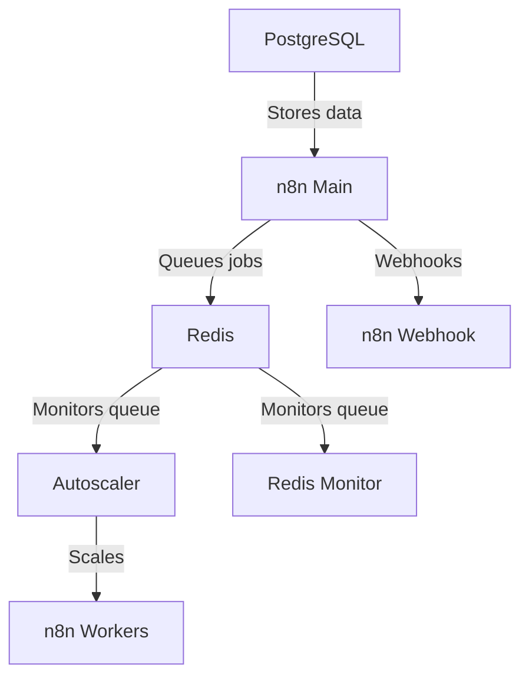

# n8n Autoscaling System

A **security-first**, production-ready autoscaling solution for n8n workflow automation. Deploy n8n securely with **zero open ports** using Cloudflare tunnels, automatic scaling, and enterprise-grade features.

## 🔒 Why This Setup?

**Traditional n8n deployments expose your server directly to the internet. This is dangerous.**

This solution provides:
- 🛡️ **Zero Attack Surface**: Cloudflare tunnels mean no open ports on your server
- 🌐 **Global DDoS Protection**: Cloudflare's network shields your instance
- 🔐 **Automatic HTTPS**: Valid SSL certificates without manual configuration
- ⚡ **Auto-scaling**: Handle any workload from 1 to hundreds of workflows
- 🏭 **Production Grade**: Comprehensive backup/restore, monitoring, and security

## 🚀 Quick Facts

✅ **Battle Tested**: Handles hundreds of simultaneous executions on 8-core 16GB VPS  
✅ **One-Click Deploy**: Interactive setup wizard configures everything  
✅ **Multi-Platform**: Auto-detects Docker/Podman, ARM64/AMD64  
✅ **Enterprise Ready**: Backup/restore, monitoring, Tailscale VPN support  

📖 **Detailed Guide**: https://www.reddit.com/r/n8n/comments/1l9mi6k/major_update_to_n8nautoscaling_build_step_by_step/

## Architecture Overview



## Features

### 🔒 Security First
- **Cloudflare tunnel integration** (recommended) - Zero open ports, DDoS protection, automatic HTTPS
- **Tailscale VPN support** - Private network access for teams
- **Secure password generation** - Cryptographically secure secrets with optional salt
- **Environment isolation** - Separate dev/test/production configurations

### ⚡ Performance & Scaling
- **Dynamic worker scaling** based on Redis queue length
- **Configurable thresholds** for scale-up/down decisions
- **Multi-architecture support** (ARM64/AMD64) with auto-detection
- **Container runtime flexibility** (Docker/Podman) with auto-detection
- **Performance tuning variables** for all components

### 🛠️ Operations & Maintenance
- **One-script installation** with interactive setup wizard
- **Comprehensive backup system** with smart PostgreSQL backups (full/incremental)
- **Point-in-time restore** with interactive recovery tool
- **Rclone cloud storage** integration (70+ providers)
- **Health checks** for all services
- **Systemd integration** for production deployments

## Prerequisites

### Required
- **Docker/Podman** and **Docker/Podman Compose**
- **Cloudflare account** with a domain (free account works fine)
- **Linux/macOS/WSL2** environment for setup scripts

### Recommended Setup Process
1. **Get Docker**: For new users, we recommend [Docker Desktop](https://www.docker.com/products/docker-desktop/) or use the [Docker convenience script](https://docs.docker.com/engine/install/ubuntu/#install-using-the-convenience-script) for Ubuntu
2. **Cloudflare Domain**: Set up a domain in Cloudflare (can be transferred from another provider)
3. **Cloudflare Tunnel**: Create a tunnel token at [Cloudflare Zero Trust](https://dash.cloudflare.com/) → Access → Tunnels

🔒 **Why Cloudflare Tunnels?**
- **No open ports**: Your server stays completely private
- **Built-in DDoS protection**: Cloudflare's global network protects your instance
- **Free SSL/TLS**: Automatic HTTPS with valid certificates
- **Access control**: Optional authentication and access policies
- **Better performance**: Cloudflare's CDN speeds up your workflows

## Quick Start (Secure Setup)

### Step 1: Cloudflare Tunnel Setup
1. **Create Cloudflare account** and add your domain
2. **Navigate to Zero Trust** → Access → Tunnels → Create tunnel
3. **Copy your tunnel token** (starts with `eyJ...`)
4. **Configure ingress rules** in the tunnel dashboard:
   - Add `n8n.yourdomain.com` → `http://localhost:5678`
   - Add `webhook.yourdomain.com` → `http://localhost:5679`
5. **Save configuration** - DNS records are created automatically

### Step 2: Deploy n8n
1. **Clone this repository**:
   ```bash
   git clone <repository-url>
   cd n8n-autoscaling
   ```

2. **Run the interactive setup wizard**:
   ```bash
   ./n8n-setup.sh
   ```
   
   The wizard will guide you through:
   - 🔐 Secure password generation
   - 🌐 Cloudflare tunnel configuration (recommended)
   - 📁 Data directory setup
   - 🗄️ Database initialization
   - 🔍 Health checks and testing

3. **Start your secure n8n instance**:
   ```bash
   docker compose up -d
   ```

🎉 **That's it!** Your n8n instance is now running securely through Cloudflare tunnels.

### 🏗️ Smart Architecture Selection

The setup wizard automatically chooses the optimal architecture:

**🔒 Cloudflare Tunnels (Recommended)**
- ✅ **Auto-detected**: When tunnel token is configured
- ✅ **No Traefik**: Direct tunnel → n8n connection  
- ✅ **Zero ports**: Maximum security
- ✅ **Command**: `docker compose -f docker-compose.yml -f docker-compose.cloudflare.yml up -d`

**🌐 Traditional Setup (Fallback)**
- ⚠️ **Used when**: No tunnel token configured
- ⚠️ **Includes Traefik**: Reverse proxy for port exposure
- ⚠️ **Requires**: Firewall configuration and SSL setup
- ⚠️ **Command**: `docker compose -f docker-compose.yml up -d`

### Alternative: Direct Access Options
- **Tailscale VPN**: Private network access for teams
- **Custom reverse proxy**: Integration with existing infrastructure 

## Setup Wizard Features

The `n8n-setup.sh` script provides:
- **Interactive Configuration**: Step-by-step guided setup
- **Automatic Path Resolution**: Converts relative paths to absolute for Docker compatibility
- **Environment Management**: Create dev/test/production environments
- **Security**: Generates secure random passwords with optional salt
- **Security Features**: Cloudflare tunnel integration (recommended), Tailscale VPN support, secure password generation
- **Optional Features**: Rclone mounts (any cloud storage), external networks, custom reverse proxy
- **Database Setup**: Automatic PostgreSQL and Redis initialization
- **Health Checks**: Verifies services are running correctly
- **Reset Options**: Clean slate functionality if you need to start over
- **Install systemd** Make your installation persistent

### Resetting Your Environment

If you need to start fresh or have issues with credentials:
```bash
./n8n-setup.sh
# Select option 3: Reset environment
```

Reset options include:
- **Everything**: Removes all data, .env file, and Docker resources
- **Just Data**: Keeps configuration but removes all database/app data  
- **Just .env**: Removes configuration file (warning: existing data won't be accessible)

## Rclone Cloud Storage Setup

The setup wizard can optionally configure rclone mounts for cloud storage integration. Rclone supports 70+ cloud storage providers including Google Drive, OneDrive, Dropbox, AWS S3, and many more.

### Installing Rclone

## Do this first if you want to use one or more mounts for data and backups

**Download Latest Version:**
```bash
# Download and install latest rclone
curl https://rclone.org/install.sh | sudo bash
```

**Or install via package manager:**
```bash
# Ubuntu/Debian
sudo apt install rclone

# macOS
brew install rclone

# CentOS/RHEL/Fedora
sudo dnf install rclone
```

### Configure Your Cloud Storage Backend

**1. Run rclone config:**
```bash
rclone config
```

**2. Create a new remote:**
- Choose `n` for "New remote"
- Give it a name (e.g., `mydrive`, `mycloud`)
- Select your storage provider from the list
- Follow the provider-specific setup instructions

**3. Test your configuration:**
```bash
# List files in your remote
rclone ls yourremotename:

# Test a specific folder
rclone ls yourremotename:/path/to/folder
```

### Popular Backend Configuration Links

- **Google Drive**: [https://rclone.org/drive/](https://rclone.org/drive/)
- **OneDrive**: [https://rclone.org/onedrive/](https://rclone.org/onedrive/)
- **Dropbox**: [https://rclone.org/dropbox/](https://rclone.org/dropbox/)
- **AWS S3**: [https://rclone.org/s3/](https://rclone.org/s3/)
- **All providers**: [https://rclone.org/overview/](https://rclone.org/overview/)

### Setting Up Mounts

**Create mount points:**
```bash
# Create directories for mounting
sudo mkdir -p /mnt/rclone-data /mnt/rclone-backups
sudo chown $USER:$USER /mnt/rclone-data /mnt/rclone-backups
```

**Mount your remote:**
```bash
# Mount your cloud storage
rclone mount yourremotename:/data /mnt/rclone-data --daemon
rclone mount yourremotename:/backups /mnt/rclone-backups --daemon

# Or mount with additional options for better performance - highly recommend reading the docs or asking an LLM for some good settings.
rclone mount yourremotename:/data /mnt/rclone-data \
  --vfs-cache-mode writes \
  --vfs-cache-max-age 1h \
  --daemon
```

**Verify mounts:**
```bash
# Check if mounted successfully
df -h | grep rclone
ls /mnt/rclone-data
```

### Automatic Mounting on Boot

**Create systemd service for automatic mounting:**
```bash
# Create service file
sudo tee /etc/systemd/system/rclone-mount.service > /dev/null <<EOF
[Unit]
Description=Rclone Mount
After=network.target

[Service]
Type=notify
ExecStart=/usr/bin/rclone mount yourremotename:/data /mnt/rclone-data --vfs-cache-mode writes --vfs-cache-max-age 1h
ExecStop=/bin/fusermount -u /mnt/rclone-data
Restart=always
User=$USER
Group=$USER

[Install]
WantedBy=multi-user.target
EOF

# Enable and start the service
sudo systemctl enable rclone-mount.service
sudo systemctl start rclone-mount.service
```

**Note**: During the n8n setup wizard, you'll be prompted to configure mount paths. Make sure your rclone mounts are active before running the setup.

## Configuration

- Make sure you set your own passwords and encryption keys in the .env file if you dont use the setup script
- By default each worker handles 10 tasks at a time, you can modify this in the docker-compose under:      
   - N8N_CONCURRENCY_PRODUCTION_LIMIT=10
- Adjust these to be greater than your longest expected workflow execution time measured in seconds:
   - N8N_QUEUE_BULL_GRACEFULSHUTDOWNTIMEOUT=300
   - N8N_GRACEFUL_SHUTDOWN_TIMEOUT=300

### Key Environment Variables

| Variable | Description | Default |
|----------|-------------|---------|
| `MIN_REPLICAS` | Minimum number of worker containers | 1 |
| `MAX_REPLICAS` | Maximum number of worker containers | 5 |
| `SCALE_UP_QUEUE_THRESHOLD` | Queue length to trigger scale up | 5 |
| `SCALE_DOWN_QUEUE_THRESHOLD` | Queue length to trigger scale down | 2 |
| `POLLING_INTERVAL_SECONDS` | How often to check queue length | 30 |
| `COOLDOWN_PERIOD_SECONDS` | Time between scaling actions | 180 |
| `QUEUE_NAME_PREFIX` | Redis queue prefix | `bull` |
| `QUEUE_NAME` | Redis queue name | `jobs` |

### n8n Configuration

Ensure these n8n environment variables are set:
- `EXECUTIONS_MODE=queue`
- `QUEUE_BULL_REDIS_HOST=redis`
- `QUEUE_HEALTH_CHECK_ACTIVE=true`

## Scaling Behavior

The autoscaler:
1. Monitors Redis queue length every `POLLING_INTERVAL_SECONDS`
2. Scales up when:
   - Queue length > `SCALE_UP_QUEUE_THRESHOLD`
   - Current replicas < `MAX_REPLICAS`
3. Scales down when:
   - Queue length < `SCALE_DOWN_QUEUE_THRESHOLD`
   - Current replicas > `MIN_REPLICAS`
4. Respects cooldown period between scaling actions

## Monitoring

The system includes:
- Redis queue monitor service (`redis-monitor`)
- Docker health checks for all services
- Detailed logging from autoscaler

## Automatic Updates

### For Docker Users
To enable automatic container updates, use [Watchtower](https://containrrr.dev/watchtower/):

```bash
docker run -d \
  --name watchtower \
  -v /var/run/docker.sock:/var/run/docker.sock \
  containrrr/watchtower \
  --schedule "0 0 2 * * *" \
  --cleanup
```

### For Podman Users
Podman auto-update is automatically configured when using the systemd service generator (`./generate-systemd.sh`). The system will check for updates daily and restart containers with newer images.

## Backups

The system includes automated backup functionality with incremental PostgreSQL backups to minimize storage and improve performance.

### Backup Components
- **PostgreSQL**: Smart backup system (full every 12h, incremental hourly)
- **Redis**: Database snapshots using BGSAVE (compressed) 
- **n8n Data**: Complete data directories including webhook data (compressed)
- **🔒 Encryption**: All backups automatically encrypted using your N8N_ENCRYPTION_KEY

### PostgreSQL Backup Strategy
The system uses a sophisticated backup approach:

- **Full Backups**: Complete database dump (larger, standalone restore)
- **Incremental Backups**: WAL (Write-Ahead Log) files only (smaller, faster)
- **Smart Backup**: Automatically chooses full (every 12h) or incremental (hourly)

This approach reduces backup time and storage space while maintaining complete recovery capability.

### Running Backups
```bash
# Smart backup (recommended - automatically chooses full or incremental)
./backup.sh

# Force specific backup types
./backup.sh postgres-full         # Force full PostgreSQL backup
./backup.sh postgres-incremental  # Force incremental PostgreSQL backup
./backup.sh postgres              # Smart PostgreSQL backup
./backup.sh redis                 # Redis backup only
./backup.sh n8n                   # n8n data backup only

# View help and cron examples
./backup.sh --help
```

### 🔒 Backup Encryption

All backups are automatically encrypted using AES-256-CBC encryption with your `N8N_ENCRYPTION_KEY`. This provides enterprise-grade security for your backup data.

**Encryption Features:**
- **Automatic**: All backups (PostgreSQL, Redis, n8n data) are encrypted by default
- **Secure**: Uses AES-256-CBC encryption with salt
- **Key Management**: Uses your existing `N8N_ENCRYPTION_KEY` (same as n8n encryption)
- **Transparent**: Restore script automatically handles encrypted backups

**Key Requirements:**
- Your `N8N_ENCRYPTION_KEY` must be at least 16 characters
- The same key is required for backup and restore operations
- Keep your encryption key secure and backed up separately

**File Extensions:**
- Encrypted backups: `.gz.enc` (e.g., `postgres_full_20240115_143022.sql.gz.enc`)
- Unencrypted backups: `.gz` (when encryption key not available)

### Recommended Cron Schedule
Add to crontab for automated backups:

**Option 1: Simple Smart Backups (Recommended)**
```bash
# Smart backups - full every 12h, incremental hourly
0 * * * * /path/to/n8n-autoscaling/backup.sh >/dev/null 2>&1
```

**Option 2: Separate Service Schedules**
```bash
# PostgreSQL full backup twice daily
0 0,12 * * * /path/to/n8n-autoscaling/backup.sh postgres-full >/dev/null 2>&1

# PostgreSQL incremental hourly (skip full backup hours)
0 1-11,13-23 * * * /path/to/n8n-autoscaling/backup.sh postgres-incremental >/dev/null 2>&1

# Other services hourly
30 * * * * /path/to/n8n-autoscaling/backup.sh redis >/dev/null 2>&1
45 * * * * /path/to/n8n-autoscaling/backup.sh n8n >/dev/null 2>&1
```

### Setting Up Cron
```bash
# Edit your crontab
crontab -e

# Add the recommended line (Option 1)
0 * * * * /path/to/n8n-autoscaling/backup.sh >/dev/null 2>&1

# Save and verify
crontab -l
```

### Rclone Cloud Storage Integration
To enable automatic cloud storage sync:
1. Uncomment `RCLONE_BACKUP_MOUNT` in `.env`
2. Ensure your rclone remote is mounted at the specified path
3. Backups will automatically sync to cloud storage and local copies will be removed
4. 7-day retention is maintained on cloud storage

### Backup Storage & Sizes
- **PostgreSQL Full**: ~50-500MB (depends on data size)
- **PostgreSQL Incremental**: ~1-50MB (depends on activity)
- **Redis**: ~1-100MB (depends on queue size)
- **n8n Data**: ~10-200MB (depends on workflows and executions)

**Storage Locations:**
- **Local**: `./backups/{postgres,redis,n8n}/` (if not using rclone cloud storage)
- **Rclone Cloud Storage**: Configured path with automatic cleanup
- **Retention**: 7 days for all backup types

### Recovery with Restore Script

The system includes an interactive restore script that automates recovery:

```bash
# Interactive restore (recommended)
./restore.sh

# List available backups
./restore.sh --list

# Dry run (see what would be restored)
./restore.sh --dry-run

# Help and options
./restore.sh --help
```

**Restore Script Features:**
- **Interactive Menu**: Choose service and backup point
- **Multi-Source Discovery**: Finds backups from both local and rclone cloud storage
- **🔒 Automatic Decryption**: Handles encrypted backups transparently using N8N_ENCRYPTION_KEY
- **Safety Backup**: Creates backup of current data before restore
- **Integrity Validation**: Verifies backup files before restore
- **Smart Container Management**: Safely stops/starts containers
- **Point-in-Time Recovery**: Shows backups with timestamps
- **Dry Run Mode**: Preview restore without making changes

**Safety Features:**
- Multiple confirmation prompts
- Automatic safety backup creation
- Backup integrity validation
- Container state management
- Detailed progress reporting

### Manual Recovery Examples
```bash
# Manual PostgreSQL restore from full backup
gunzip < postgres_full_20240115_143022.sql.gz | docker compose exec -T postgres psql -U postgres -d n8n

# For incremental recovery:
# 1. Restore the latest full backup
# 2. Apply WAL files in chronological order
# (Use restore.sh for automated incremental recovery)
```

## Performance Tuning

The system includes extensive performance tuning options in `.env.example`. Uncomment and adjust these variables as needed:

### n8n Performance
- `N8N_CONCURRENCY_PRODUCTION_LIMIT`: Tasks per worker (default: 10)
- `N8N_EXECUTIONS_DATA_PRUNE`: Enable automatic execution data cleanup
- `N8N_EXECUTIONS_DATA_MAX_AGE`: Keep executions for X hours (default: 336 = 2 weeks)
- `NODE_OPTIONS`: Node.js memory limits and optimization flags
- `UV_THREADPOOL_SIZE`: Node.js thread pool size for I/O operations

### PostgreSQL Performance
- `POSTGRES_SHARED_BUFFERS`: Memory for caching data (default: 256MB)
- `POSTGRES_EFFECTIVE_CACHE_SIZE`: Total memory available for caching (default: 1GB)
- `POSTGRES_WORK_MEM`: Memory per query operation (default: 4MB)
- `POSTGRES_MAX_WORKER_PROCESSES`: Background worker processes
- Parallel query settings for improved performance on multi-core systems

### Redis Performance
- `REDIS_MAXMEMORY`: Maximum memory usage (default: 512mb)
- `REDIS_MAXMEMORY_POLICY`: Eviction policy when memory limit reached
- `REDIS_SAVE_*`: Persistence configuration for snapshots
- Connection and networking optimizations

### Autoscaler Performance
- `AUTOSCALER_CPU_LIMIT`: CPU limit for autoscaler container
- `AUTOSCALER_MEMORY_LIMIT`: Memory limit for autoscaler container
- `AUTOSCALER_REDIS_POOL_SIZE`: Connection pool size for Redis
- `AUTOSCALER_DOCKER_TIMEOUT`: Timeout for Docker operations

All performance variables are commented out by default. Uncomment and adjust based on your system resources and workload requirements.

## Security Best Practices

### Recommended: Cloudflare Tunnels (Default)
✅ **Zero Attack Surface**: No open ports on your server  
✅ **DDoS Protection**: Cloudflare's global network shields your instance  
✅ **Automatic HTTPS**: Valid SSL certificates without configuration  
✅ **Access Control**: Optional authentication and IP restrictions  
✅ **Audit Logs**: Track all access attempts

### ⚠️ Security Considerations

**Container Runtime Security**: The autoscaler requires container runtime socket access. Security varies significantly:

#### Security Ranking (Automatic Detection)
1. **🟢 Rootless Podman** - Maximum security, containers run as regular user
2. **🟡 Rootless Docker** - Good security with user namespaces  
3. **🔴 Rootful Podman** - Limited security, some root access
4. **🔴 Rootful Docker** - Poor security, full root access equivalent

**Automatic Security Features**:
- **Smart Detection**: Setup script automatically detects and ranks available container runtimes
- **Security Warnings**: Clear warnings displayed for rootful modes with migration guidance
- **Migration Instructions**: Step-by-step commands to upgrade to more secure configurations
- **User Confirmation**: Explicit acknowledgment required to proceed with less secure setups

**Database Security**: 
- PostgreSQL defaults to localhost-only binding for security
- Use strong passwords (automatically generated by setup script)
- Consider enabling Tailscale for secure remote database access

**Backup Security**:
- ✅ **Automatic Encryption**: All backups encrypted with AES-256-CBC using N8N_ENCRYPTION_KEY
- ✅ **Secure by Default**: No configuration needed - encryption happens automatically
- ⚠️ **Key Management**: Keep your N8N_ENCRYPTION_KEY secure and backed up separately

### 🔒 Production Security Checklist

Before deploying to production, ensure:

**✅ Authentication & Access**
- [ ] Change all default passwords (setup script enforces this)
- [ ] Enable Cloudflare tunnels (recommended) or configure firewall rules
- [ ] Set up Tailscale VPN for team access (optional)
- [ ] Configure proper user management in n8n

**✅ Network Security** 
- [ ] PostgreSQL bound to localhost only (default)
- [ ] Redis password authentication enabled (default)
- [ ] No unnecessary ports exposed to internet
- [ ] External network configuration reviewed

**✅ Data Protection**
- [ ] Backup encryption configured
- [ ] SSL/TLS certificates valid
- [ ] Environment variables secured
- [ ] Log files protected from unauthorized access

**✅ System Hardening**
- [ ] Docker socket access reviewed and understood
- [ ] Container user permissions verified
- [ ] System updates applied
- [ ] Monitoring and alerting configured  

**Webhook URLs**: When using Cloudflare tunnels, webhooks automatically use your secure subdomain:
```
https://webhook.yourdomain.com/webhook/d7e73b77-6cfb-4add-b454-41e4c91461d8
```

### Security Comparison

| Method | Security | Setup Complexity | Public Access | DDoS Protection | Certificate Management |
|--------|----------|------------------|---------------|-----------------|----------------------|
| **Cloudflare Tunnel** | 🟢 Excellent | 🟢 Easy | ✅ Yes | ✅ Built-in | ✅ Automatic |
| **Tailscale VPN** | 🟢 Excellent | 🟡 Medium | ❌ No | ❌ None | ✅ Automatic |
| **Direct Exposure** | 🔴 Poor | 🔴 Hard | ✅ Yes | ❌ None | ❌ Manual |

**Recommendation**: Use Cloudflare tunnels for production deployments. Only consider alternatives for specific use cases like private team access (Tailscale) or development environments (direct).

## Troubleshooting

### Cloudflare Tunnel Issues
- **Tunnel not connecting**: Verify your tunnel token is correct and active
- **DNS not resolving**: Check that Cloudflare DNS records were created automatically
- **502 Bad Gateway**: Ensure n8n services are running: `docker compose ps`
- **Tunnel status**: Check tunnel logs: `docker compose logs cloudflared`

### General Issues
- **Check container logs**: `docker compose logs [service]`
- **Verify Redis connection**: `docker compose exec redis redis-cli -a "${REDIS_PASSWORD}" ping`
- **Check queue length**: `docker compose exec redis redis-cli -a "${REDIS_PASSWORD}" LLEN bull:jobs:wait`
- **Database connection**: `docker compose exec postgres pg_isready`

### Performance Issues
- **Workers not scaling**: Check Redis connection and queue monitoring
- **Slow responses**: Review `N8N_CONCURRENCY_PRODUCTION_LIMIT` setting
- **Memory issues**: Monitor container resource usage: `docker stats`


## License

MIT License - See [LICENSE](LICENSE) for details.
