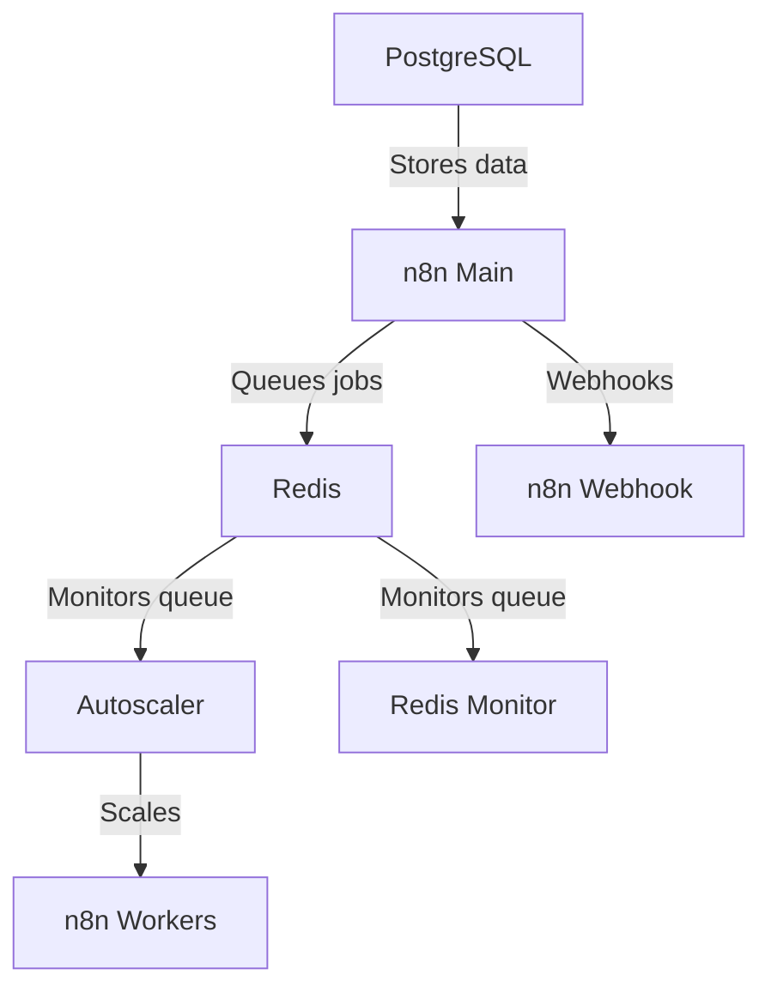

Now includes cloudflared. Configure on cloudflare.com and paste your token in the .env file.  

for step by step instructions follow this guide: https://www.reddit.com/r/n8n/comments/1l9mi6k/major_update_to_n8nautoscaling_build_step_by_step/

original version without cloudflared is saved in the branches for those who don't want to use it. 

# n8n Autoscaling System

A Docker-based autoscaling solution for n8n workflow automation platform. Dynamically scales worker containers based on Redis queue length.  No need to deal with k8s or any other container scaling provider, a simple script runs it all and is easily configurable.

Tested with hundreds of simultaneous executions running on a 8 core 16gb ram VPS.  

Includes Puppeteer and Chrome built-in for pro level scraping from the n8n code node, works better than the community nodes.  

Simple install, just clone the files + docker compose up

## Architecture Overview



## Features

- Dynamic scaling of n8n worker containers based on queue length
- Configurable scaling thresholds and limits
- Redis queue monitoring
- Docker Compose-based deployment
- Health checks for all services

## Prerequisites

- Docker and Docker Compose.
- If you are a new user, I recommend either docker desktop or using the docker convenience script for ubuntu.  
- Set up your cloudflare domain and subdomains.

## Quick Start

1. Copy or Clone this repository to a folder of your choice
2. Copy and configure environment:
   ```bash
   cp .env.example .env
   # Edit .env - defaults are good to go, but set new passwords and tokens
   ```
3. Run setup and start services:
   ```bash
   ./setup.sh
   docker compose up -d
   ```

That's it! The setup script creates all necessary directories and handles both Docker and Podman automatically.  

## Configuration

- Make sure you set your own passwords and encryption keys in the .env file!!!
- By default each worker handles 10 tasks at a time, you can modify this in the docker-compose under:      
   - N8N_CONCURRENCY_PRODUCTION_LIMIT=10
- Adjust these to be greater than your longest expected workflow execution time measured in seconds:
   - N8N_QUEUE_BULL_GRACEFULSHUTDOWNTIMEOUT=300
   - N8N_GRACEFUL_SHUTDOWN_TIMEOUT=300

### Key Environment Variables

| Variable | Description | Default |
|----------|-------------|---------|
| `MIN_REPLICAS` | Minimum number of worker containers | 1 |
| `MAX_REPLICAS` | Maximum number of worker containers | 5 |
| `SCALE_UP_QUEUE_THRESHOLD` | Queue length to trigger scale up | 5 |
| `SCALE_DOWN_QUEUE_THRESHOLD` | Queue length to trigger scale down | 2 |
| `POLLING_INTERVAL_SECONDS` | How often to check queue length | 30 |
| `COOLDOWN_PERIOD_SECONDS` | Time between scaling actions | 180 |
| `QUEUE_NAME_PREFIX` | Redis queue prefix | `bull` |
| `QUEUE_NAME` | Redis queue name | `jobs` |

### n8n Configuration

Ensure these n8n environment variables are set:
- `EXECUTIONS_MODE=queue`
- `QUEUE_BULL_REDIS_HOST=redis`
- `QUEUE_HEALTH_CHECK_ACTIVE=true`

## Scaling Behavior

The autoscaler:
1. Monitors Redis queue length every `POLLING_INTERVAL_SECONDS`
2. Scales up when:
   - Queue length > `SCALE_UP_QUEUE_THRESHOLD`
   - Current replicas < `MAX_REPLICAS`
3. Scales down when:
   - Queue length < `SCALE_DOWN_QUEUE_THRESHOLD`
   - Current replicas > `MIN_REPLICAS`
4. Respects cooldown period between scaling actions

## Monitoring

The system includes:
- Redis queue monitor service (`redis-monitor`)
- Docker health checks for all services
- Detailed logging from autoscaler

## Automatic Updates

### For Docker Users
To enable automatic container updates, use [Watchtower](https://containrrr.dev/watchtower/):

```bash
docker run -d \
  --name watchtower \
  -v /var/run/docker.sock:/var/run/docker.sock \
  containrrr/watchtower \
  --schedule "0 0 2 * * *" \
  --cleanup
```

### For Podman Users
Podman auto-update is automatically configured when using the systemd service generator (`./generate-systemd.sh`). The system will check for updates daily and restart containers with newer images.

## Backups

The system includes automated backup functionality for all critical data:

### Backup Components
- **PostgreSQL**: Full database backup (compressed)
- **Redis**: Database snapshot (compressed) 
- **n8n Data**: Complete data directories including webhook data (compressed)

### Running Backups
```bash
# Manual backup (all services)
./backup.sh

# Backup specific service
./backup.sh postgres
./backup.sh redis
./backup.sh n8n
```

### Automatic Backups
Add to crontab for automated backups:
```bash
# Hourly backups
0 * * * * /path/to/n8n-autoscaling/backup.sh >/dev/null 2>&1

# PostgreSQL full backup twice daily
0 0,12 * * * /path/to/n8n-autoscaling/backup.sh postgres >/dev/null 2>&1
```

### Google Drive Integration
To enable automatic Google Drive sync:
1. Uncomment `GDRIVE_BACKUP_MOUNT` in `.env`
2. Ensure Google Drive is mounted at the specified path
3. Backups will automatically sync to Google Drive and local copies will be removed
4. 7-day retention is maintained on Google Drive

### Backup Storage
- **Local**: `./backups/{postgres,redis,n8n}/` (if not using Google Drive)
- **Google Drive**: Configured path with automatic cleanup
- **Retention**: 7 days for all backup types

## Performance Tuning

The system includes extensive performance tuning options in `.env.example`. Uncomment and adjust these variables as needed:

### n8n Performance
- `N8N_CONCURRENCY_PRODUCTION_LIMIT`: Tasks per worker (default: 10)
- `N8N_EXECUTIONS_DATA_PRUNE`: Enable automatic execution data cleanup
- `N8N_EXECUTIONS_DATA_MAX_AGE`: Keep executions for X hours (default: 336 = 2 weeks)
- `NODE_OPTIONS`: Node.js memory limits and optimization flags
- `UV_THREADPOOL_SIZE`: Node.js thread pool size for I/O operations

### PostgreSQL Performance
- `POSTGRES_SHARED_BUFFERS`: Memory for caching data (default: 256MB)
- `POSTGRES_EFFECTIVE_CACHE_SIZE`: Total memory available for caching (default: 1GB)
- `POSTGRES_WORK_MEM`: Memory per query operation (default: 4MB)
- `POSTGRES_MAX_WORKER_PROCESSES`: Background worker processes
- Parallel query settings for improved performance on multi-core systems

### Redis Performance
- `REDIS_MAXMEMORY`: Maximum memory usage (default: 512mb)
- `REDIS_MAXMEMORY_POLICY`: Eviction policy when memory limit reached
- `REDIS_SAVE_*`: Persistence configuration for snapshots
- Connection and networking optimizations

### Autoscaler Performance
- `AUTOSCALER_CPU_LIMIT`: CPU limit for autoscaler container
- `AUTOSCALER_MEMORY_LIMIT`: Memory limit for autoscaler container
- `AUTOSCALER_REDIS_POOL_SIZE`: Connection pool size for Redis
- `AUTOSCALER_DOCKER_TIMEOUT`: Timeout for Docker operations

All performance variables are commented out by default. Uncomment and adjust based on your system resources and workload requirements.

## Troubleshooting

- Check container logs: `docker compose logs [service]`
- Verify Redis connection: `docker compose exec redis redis-cli -a "${REDIS_PASSWORD}" ping`
- Check queue length manually: `docker compose exec redis redis-cli -a "${REDIS_PASSWORD}" LLEN bull:jobs:wait`

Webhook URL example:
Webhooks use your cloudflare subdomain name not local host, example:
http://webhook.domain.com/webhook/d7e73b77-6cfb-4add-b454-41e4c91461d8


## License

MIT License - See [LICENSE](LICENSE) for details.
